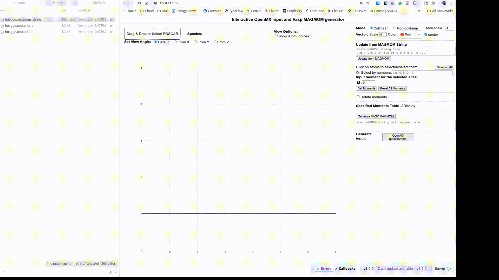
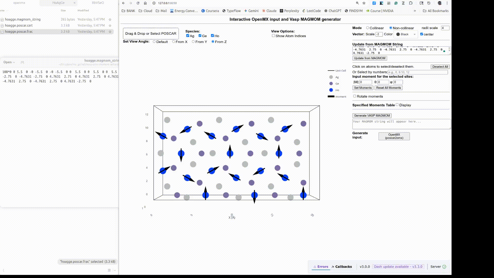
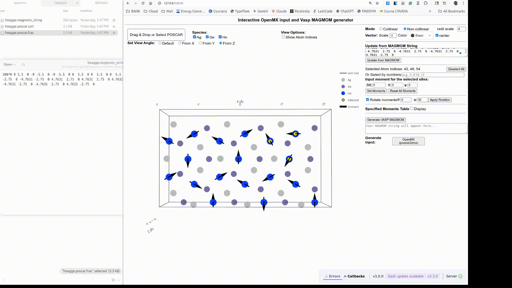
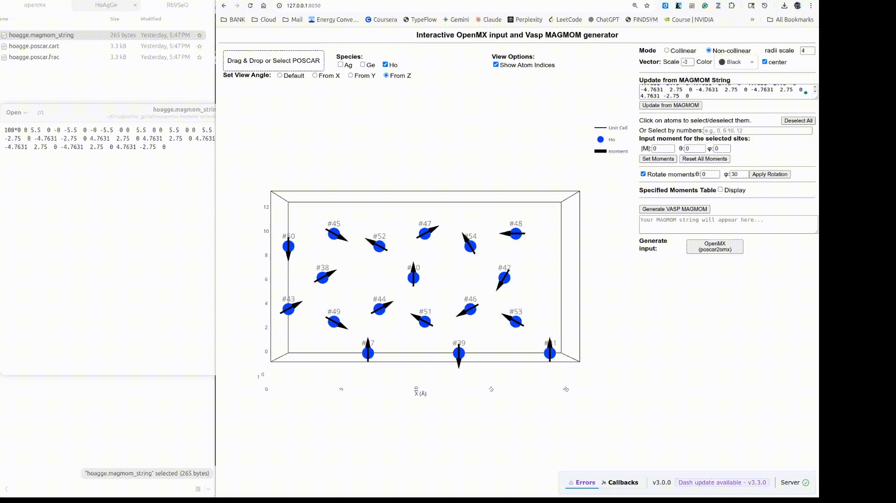

# Interactive VASP MAGMOM Generator

A web application built with Dash and Plotly to interactively set up, visualize, and generate magnetic moment configurations for VASP and OpenMX input file

## Usage Examples
### Visualize complex magnetic structure from POSCAR and MAGMAOM string



### Moment Manipulations
Select interactively



or specify atom id number



### Generate MAGOM string and OpenMX input



## 🚀 Features

* **Upload & Visualize:** Load a `POSCAR` or OpenMX `*.dat`file to display an interactive 3D structure.
* **Structure Controls:**
    * Toggle visibility for each atomic species.
    * Show or hide all atom indices.
    * Set preset view angles (X, Y, Z) or rotate/pan/zoom manually.
    * Customize moment vectors (size, color and shift).
    * Colors are loaded from VESTA's `element.ini` file (if present).
* **Atom Selection:**
    * Select/deselect individual atoms by clicking.
    * Select atoms in bulk using text input (e.g., `1, 3:6, 9`).
    * "Deselect All" button.
* **Moment Configuration:**
    * Switch between **Collinear** (default x) and **Non-collinear** (magnitude, $\theta$, $\phi$) modes.
    * **Set/Update:** Apply magnetic moments to all selected atoms.
    * **Rotate:** Apply a rotation (by $\theta$ and $\phi$) to the existing moments of selected atoms.
    * **Reset:** Clear all magnetic moments to zero.
* **Import/Export:**
    * **Update from MAGMOM:** Paste a VASP `MAGMOM` string (collinear or non-collinear) to add vector in the structure view.
    * **Generate MAGMOM:** Get the final, formatted `MAGMOM` string ready for your `INCAR` file.
    * **OpenM support:** 
    * **Modify OpenMX input moments:** If the openmx *dat format is detected, an option for modifying spin moments will appear.  
* **(Optional) OpenMX Support:**
    * *Includes features to generate OpenMX input files from VASP (if `poscar2openmx` is installed).*

## 🔧 Installation

1.  **Clone the repository:**
    ```bash
    git clone https://github.com/pohao82/vasp-omx-moment-setter.git
    cd vasp-omx-moment-setter.git
    ```

2.  **Create a virtual environment (Recommended):**
    ```bash
    python -m venv venv
    source venv/bin/activate
    ```

3.  **Install the required packages:**
    The core dependencies are Dash, Plotly, and NumPy.
    ```bash
    pip install dash numpy plotly
    ```
    *To match the versions used in development:*
    ```bash
    pip install dash==3.2.0 numpy==2.3.4 plotly==5.24.1
    ```

4.  **Optional: For OpenMX Functionality**
    To use the "Generate OpenMX" features, you must also install the [`poscar2openmx`](https://github.com/pohao82/poscar2openmx) library:

    ```bash
    pip install git+https://github.com/pohao82/poscar2openmx.git
    ```

## Running the App

To run the application locally, execute the main `app.py` script from the root directory:

```bash
python app.py
```

## Important Notes
* [poscar2openmx](https://github.com/pohao82/poscar2openmx.git) is another standalone libray which can be used independently. It is only relevant if you want to generate input for OpenMX calculations.# vasp-omx-moment-setter
